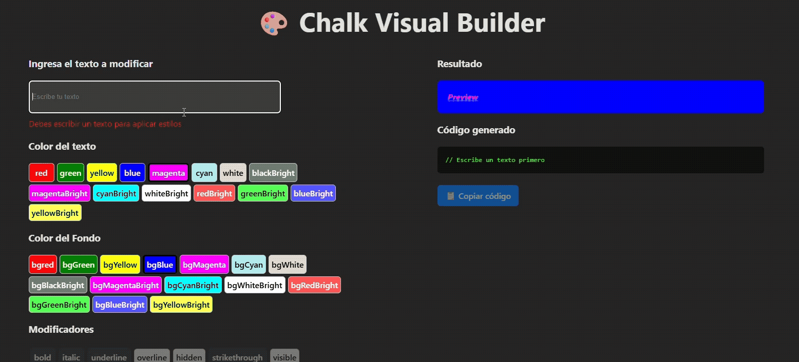

# 🎨 Chalk Visual Builder

Una aplicación en React que permite construir visualmente estilos de **Chalk (Node.js)** y generar automáticamente el código correspondiente.

El usuario puede:

- Escribir un texto
- Seleccionar color de texto
- Seleccionar color de fondo
- Aplicar modificadores (bold, italic, underline, etc.)
- Ver una vista previa en tiempo real
- Copiar el código Chalk generado

---

